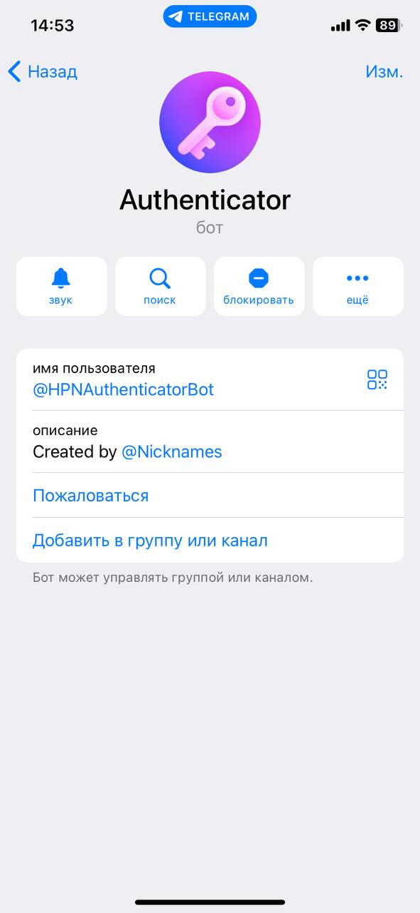
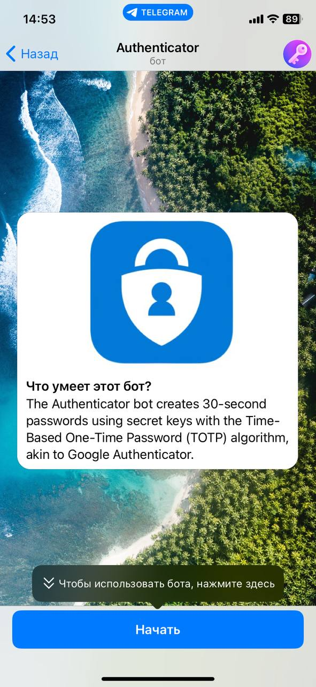
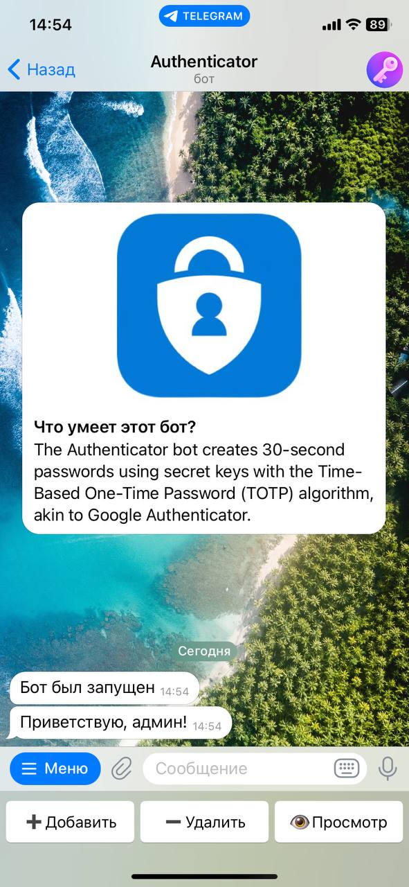
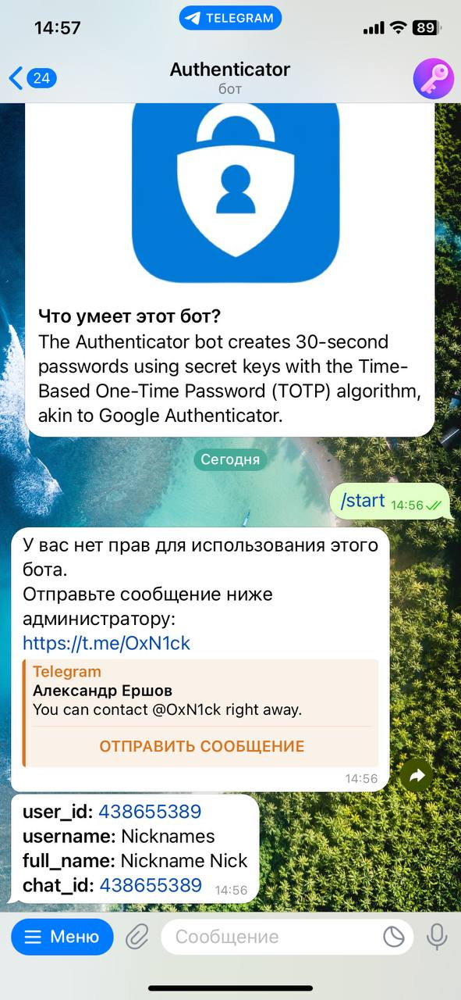
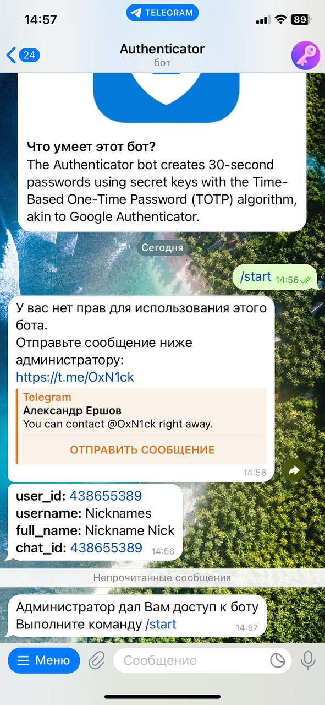
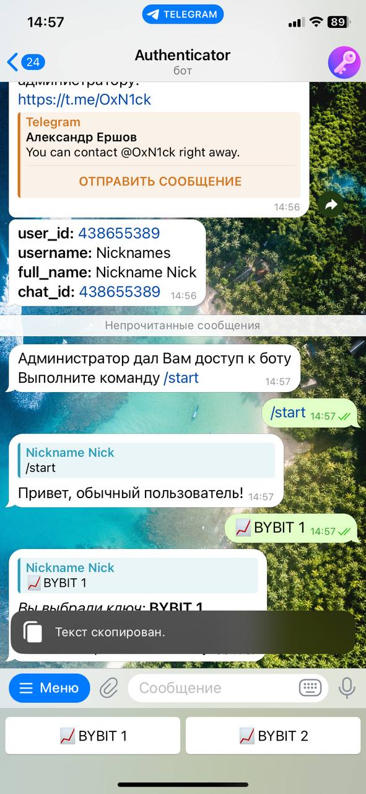

# AuthenticatorBot

The TOTP Generator bot enables users to generate one-time 30-second passwords based on secret keys. It employs the Time-Based One-Time Password (TOTP) algorithm, similar to the one used in Google Authenticator and other authenticators.
## Installation

### Docker:
1. If you don't have Docker, download and install it.
2. Launch the project with the command `docker-compose up`.
3. You have to run migrations once while the all project is running `docker-compose exec bot alembic upgrade head`

### Without Docker:
1. Create a virtual environment (venv).
2. Install the dependencies from `requirements.txt` using the command `pip install -r requirements.txt --pre`.
3. Run the project with the command `python3 bot.py`.
4. You have to run migrations once while the all project is running `alembic upgrade head`

## Configuration

1. Create a `.env` file in the root directory of the project and add the following environment variables:

```
BOT_TOKEN=<your_token>
ADMINS=<admins_id>

and the following parameters in .env ...
```
## Usage for user

To get started with the AuthenticatorBot, follow these steps:

1. Start a conversation with the bot on Telegram.

2. Type the /start command to initiate the authentication process.

3. The bot will respond with a notification indicating that you do not have the required permissions. You will be prompted to provide specific information that the admin needs to grant you access.
 
4. Contact the admin and provide the requested information. The admin will review your request and, if approved, grant you the necessary permissions.

5. Once the admin has provided access, you will receive a notification from the bot indicating that you now have the required permissions.

6. You can now interact with the bot and use its features as intended.
## Screenshots

### Main

 

_Description of the bot._

### Admin

 

_Description for admin._

### User

  

_Description for user._

## Contributing

If you would like to contribute to the development of the project, you can:

- Open an issue with a description of your problem or suggestion for improvement.
- Create a pull request with fixes or new features.

## License

AuthenticatorBot is distributed under the MIT License. See [LICENSE](LICENSE) for more information.
